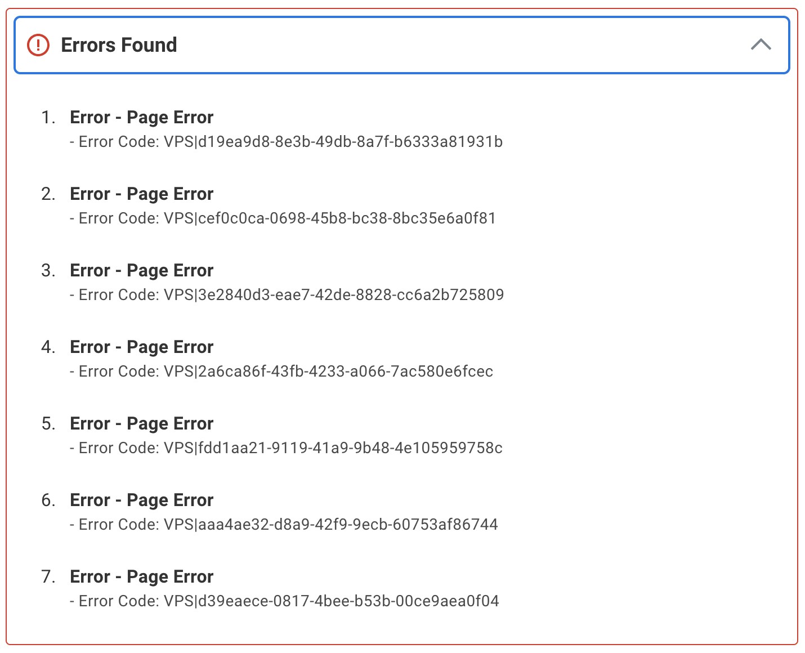

Prepared for Workday by [Loren Heyns](https://dreamstudio.com/loren)

# Proposed Fixes for Applicant System

### PRIMARY ISSUE

The standard Harvard resume template (used by the majority of college grads) is not parsed effectively by the [myworkdayjobs.com](https://myworkdayjobs.com) application system. Additional issues and errors documented below.

### WORK AROUND FOR APPLICANTS

Use a simple .txt file with minimal fields. Example: [workday.txt](https://model.earth/cv/bios/LorenHeyns/resume/LorenKevinHeyns-Workday.txt)

[Additional tips on Workday Resume Parsing](https://www.reddit.com/r/recruitinghell/comments/1kt16ib/tips_for_workday_resume_parsing/) (reddit) and a [Word docx template](https://www.linkedin.com/posts/tonyhammon1_workday-resume-format-activity-7114380680414789633-gsaR/).

As a user, you can test parsing by backing up from the third tab ("My Experience") to the first tab and reattach. (Avoid using the browser back button or you will be unable to backup.)

To upload a fresh resume for parsing, you can also delete the application for a specific job.

### QUICK FIX

Workday could include links to sample templates that the Workday site will properly parse. Where the Workday site states supported formats, add a link on each to the template: "Upload either DOC, DOCX, HTML, PDF, or [TXT](https://dreamstudio.com/cv/bios/LorenHeyns/resume/LorenKevinHeyns-workday.txt) file types (5MB max) - click to view templates"

<!-- Avoid periods in organization names (no domains) -->

### PROPOSED

1.) When a resume is deleted and reattached, allow the user to return to the parsing process to apply the revisions.

2.) And/or provide an external stand-alone page where the applicant can test the parsing.
- Isolate the parsing engine in a GitHub repo where users can contribute improvements.
- Implement a test process that uses a large set of resumes to refine parsing accuracy.

3.) Update the Workday system to retain state when backing up in the browser.

4.) "How Did You Hear About Us?" needs to include: "From my Employer"

5.) Allow the skills to be reordered by the applicant since the default parsing gives priority to less technical skills. 

6.) In the Resume/CV section on the My Experience tab, include: "Updating your resume here will not impact the populated fields."

7.) In the "Application Questions" section, proveid a "Use Prior Input" checkbox and populate from the browser cache.

8.) Typing in the "Field of Study" does not auto-select without hitting return.

9.) Using the new Twitter domain x.com results in "Invalide Twitter name".

10.) Tabs at the top are not clickable, requires multiple "back" clicks.

11.) Input is lost without providing clear errors. Example of unclear error:

Loren Heyns is available to make updates. Contact him at [DreamStudio.com/Loren](https://dreamstudio.com/loren) &nbsp;678-468-1000
